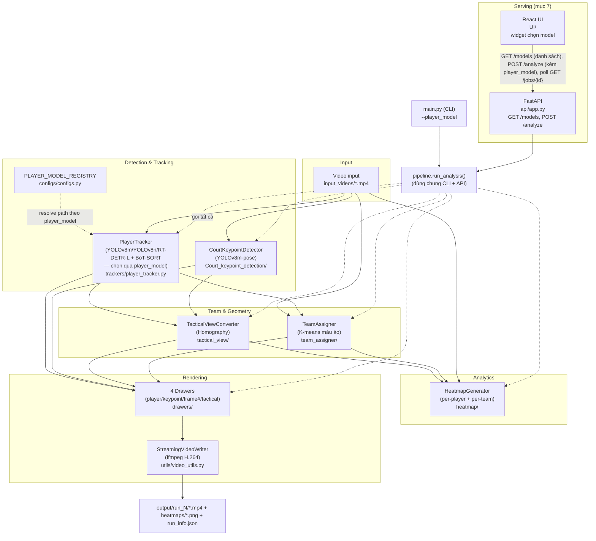
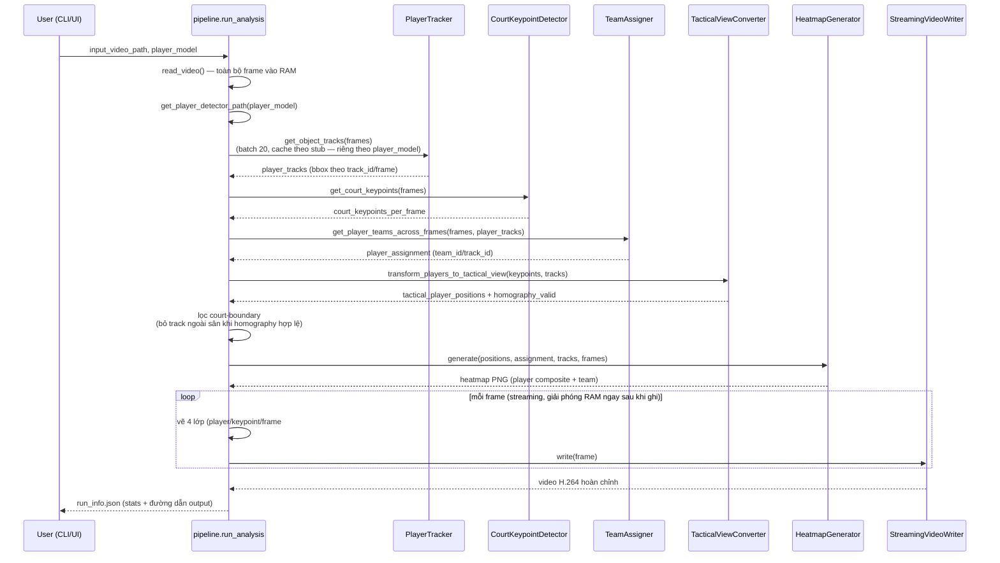

# Kiến trúc hệ thống

Sơ đồ kiến trúc module + luồng xử lý end-to-end cho
`AI_BasketBall_Analysis_v1`. Render trực tiếp trên GitHub (Mermaid), không
cần file ảnh riêng.

---

## 1. Kiến trúc module

**Ghi chú kiến trúc quan trọng** (đã đổi so với repo gốc — xem
`DISCOVERY_REPORT.md`/`PRD_CLAUDE_CODE.md` để biết lý do):
- Ball detection/tracking, pass/interception, ball possession — **đã bỏ**
  (out-of-scope theo PRD, thu hẹp còn 2 chức năng: track player + heatmap).
- Tracker: BoT-SORT (Ultralytics native, có Camera Motion Compensation +
  Re-ID) thay ByteTrack thuần của repo gốc.
- Team assigner: K-means color clustering thay Fashion CLIP (nhẹ, không
  cần internet/model ngoài).
- Player detector có thể chọn giữa 3 kiến trúc đã train thật (YOLOv8m mặc
  định, YOLOv8n, RT-DETR-L — số liệu mAP xem `REPORT.md` mục 3.1/3.3), qua
  `PLAYER_MODEL_REGISTRY` (`configs/configs.py`) → `pipeline.run_analysis(player_model=...)`
  → `--player_model` (CLI) hoặc form field `player_model` (`POST /analyze`).
  Stub cache tách riêng theo model (`stubs/<video>/<model>/...`); stub
  court-keypoint vẫn dùng chung theo video vì không phụ thuộc detector
  cầu thủ. Chỉ 3 model này có file `.pt` thật trong repo.

## 2. Luồng xử lý end-to-end (1 lần chạy `pipeline.run_analysis()`)

**Vì sao streaming ở bước vẽ cuối**: giữ toàn bộ video trong RAM 1 lần
(cần thiết vì 3 bước detect/track/keypoint/team-assign đều duyệt hết
frame) là chấp nhận được, nhưng **vẽ + ghi video phải streaming từng
frame** — nếu không sẽ tạo thêm nhiều bản copy toàn video (1 bản/drawer),
gây tràn RAM với video dài/độ phân giải cao (đã gặp thật với video 2312
frame/1080p, xem `DISCOVERY_REPORT.md`).
