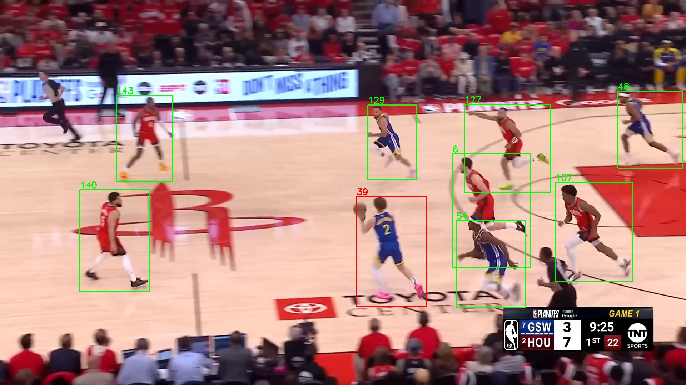
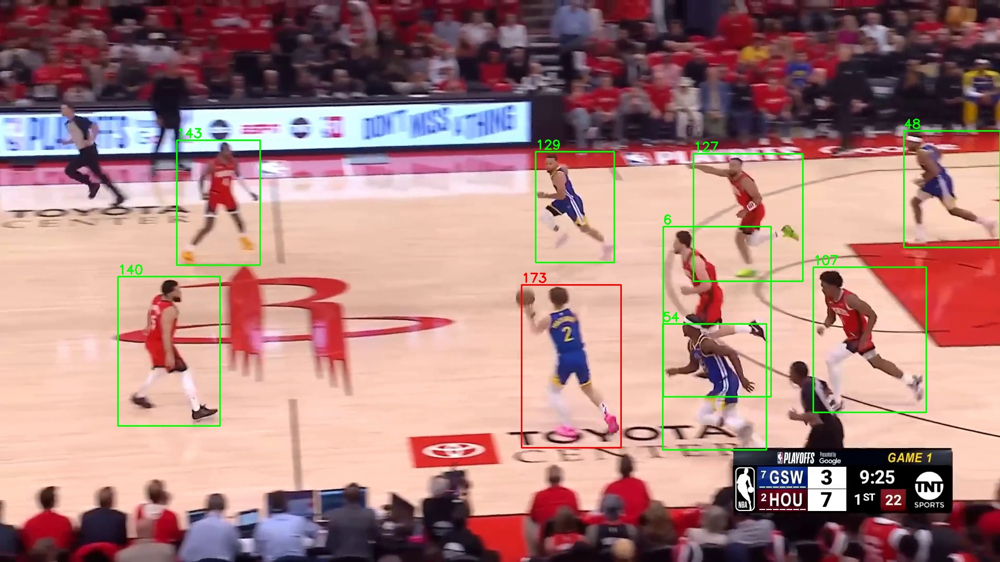
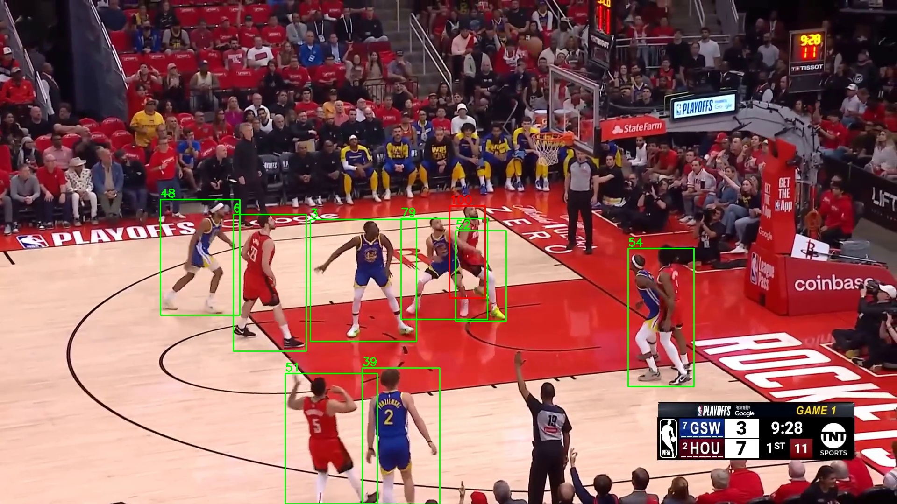

# Báo cáo dự án — Basketball Player Tracking & Heatmap Analysis

Tài liệu này tổng hợp đủ 7 mục bắt buộc theo yêu cầu bài mini-project cuối
module Computer Vision (`yeucau.docx`). Đang được viết dần theo từng phiên
làm việc — trạng thái từng mục được đánh dấu rõ ở đầu mỗi phần.

---

## 1. Problem Statement ✅

**Bài toán.** Cho một đoạn video bóng rổ quay theo góc broadcast (camera
pan/zoom liên tục theo bóng), hệ thống cần:
1. Theo dõi (track) từng cầu thủ với ID nhất quán xuyên suốt clip, chịu
   được chuyển động camera và occlusion giữa các cầu thủ.
2. Tạo heatmap thể hiện vùng hoạt động / cường độ di chuyển cho **từng cầu
   thủ** và **từng đội**, ánh xạ lên toạ độ sân thực (top-down), không
   phải toạ độ pixel thô của video gốc.

**Cho ai.** HLV / trợ lý phân tích (analyst) muốn hiểu nhanh vùng hoạt
động, cường độ di chuyển của cầu thủ/đội sau trận, thay vì phải xem lại
toàn bộ video bằng mắt.

**Đo thành công bằng gì, và vì sao:**

| Khía cạnh | Metric | Lý do chọn |
|---|---|---|
| Detection | mAP50 / mAP50-95 (class `player`) | Chất lượng tracking phụ thuộc trực tiếp vào chất lượng detect từng frame — đây là chặn trên cho mọi bước sau |
| Tracking | Tỉ lệ fragment ID (số track_id thô / số cầu thủ thật trên sân) | Phản ánh trực tiếp độ tin cậy của heatmap: 1 cầu thủ bị tách thành nhiều track_id nghĩa là dữ liệu heatmap của người đó bị phân mảnh sai, heatmap không còn đúng nghĩa "1 cầu thủ" |
| Deployment | Latency / FPS lúc suy luận (PyTorch vs ONNXRuntime) | Đo khả năng triển khai thực tế — mục 7 |

---

## 2. Data ✅

**Nguồn.** Roboflow (workspace gốc `workspace-5ujvu`, dataset NBA player
detector), huấn luyện thật trên Kaggle (2× Tesla T4), dataset nội bộ tại
`/kaggle/working/basketball_dataset/data.yaml`.

**Số lớp và class thật (nc=10)** — xác nhận trực tiếp từ weight đã train
(`model.names`), **không phải chỉ class `player` như giả định ban đầu
trong PRD** (đã đính chính ở `DISCOVERY_REPORT.md`):

```
ball, ball-in-basket, number, player, player-in-possession,
player-jump-shot, player-layup-dunk, player-shot-block, referee, rim
```

**Số lượng.** Tập validation: **96 ảnh / 1953 instance** (đọc từ log eval
thật khi train). Tập train không có số liệu ghi log cụ thể trong các file
W&B đã trích xuất — cần kiểm tra trực tiếp trên Roboflow project nếu cần
con số chính xác.

**Mất cân bằng lớp — rõ rệt.** Trong 96 ảnh validation:

| Class | Số ảnh chứa class này / 96 | Số instance |
|---|---|---|
| player, number, referee, rim | 96 (100%) | 908 / 522 / 287 / 96 |
| ball | 88 | 88 |
| player-in-possession, player-jump-shot | 17 | 17 / 17 |
| ball-in-basket, player-shot-block | 9 | 9 / 9 |

Các class hiếm (`ball-in-basket`, `player-shot-block`, `player-jump-shot`,
`player-in-possession`) chỉ xuất hiện ở 9–17/96 ảnh — chênh lệch >10 lần
so với class phổ biến nhất. Điều này giải thích vì sao mAP50-95 của các
class hiếm thấp hơn hẳn (0.33–0.50) so với `player`/`referee` (0.72–0.75)
— xem chi tiết ở mục 4.

**Augmentation** (đọc trực tiếp từ hyperparameter log thật của lần train
cuối, không phải suy đoán):

- `mosaic=1.0`, `mixup=0.1`, `auto_augment=randaugment`, `erasing=0.4`
- Màu sắc: `hsv_h=0.015`, `hsv_s=0.7`, `hsv_v=0.4`
- Hình học: `degrees=10.0` (xoay), `translate=0.1`, `scale=0.5`,
  `shear=0.0`, `perspective=0.0`
- **`fliplr=0.0`, `flipud=0.0` — KHÔNG lật ảnh**, khác với augmentation
  detection tiêu chuẩn (thường bật `fliplr=0.5`). Đây là lựa chọn hợp lý
  cho bài toán này: lật ảnh sẽ làm số áo (class `number`) bị đảo ngược
  (khó đọc/gây nhiễu nhãn), và có thể đảo sai hướng tấn công/vị trí rổ
  trên sân.

---

## 3. Method & Training ✅

**Quy trình huấn luyện.** Cả 2 model đi theo cùng 1 pipeline (khung quy
trình ở `training/player_detection_train.ipynb` và
`training/keypoint_court_train.ipynb` — 2 notebook này là **skeleton mô tả
quy trình**, giá trị hyperparameter thật lấy từ `args.yaml`/log thật của
lần train trên Kaggle, không phải giá trị mặc định ghi trong notebook):
tải dataset từ Roboflow → train bằng Ultralytics YOLO API → validate bằng
`.val()` trên tập validation → xuất `best.pt` theo fitness tốt nhất trong
quá trình train (không nhất thiết là epoch cuối cùng).

### 3.1. Player detector — chọn model & ablation kiến trúc

**Model dùng trong pipeline: YOLOv8m** (fine-tune từ `yolov8m.pt` pretrained
COCO). Lý do chọn: độ phức tạp vừa đủ cho bài toán 10 class trên sân bóng
rổ — không chọn model lớn nhất (yolov8x) vì clip xử lý theo pipeline CPU
thời gian thực (mục 7), cần cân bằng độ chính xác/tốc độ.

**Ablation có kiểm soát**: so sánh **YOLOv8n vs YOLOv8m**, giữ nguyên
**data, seed=42, epoch budget=100, batch=8, imgsz=640** — chỉ đổi đúng 1
biến là kiến trúc (số tham số: yolov8n ~3.0M, yolov8m ~25.8M).

| Model | Epoch dừng (early-stop) | mAP50 | mAP50-95 | Precision | Recall |
|---|---|---|---|---|---|
| YOLOv8n | 86/100 | 0.726 | 0.434 | 0.828 | 0.619 |
| **YOLOv8m** | 61/100 | **0.757** | **0.527** | 0.836 | 0.678 |

→ YOLOv8m tốt hơn rõ rệt trên mọi metric (đặc biệt mAP50-95, chênh ~0.09)
dù cả 2 đều early-stop trước khi hết ngân sách 100 epoch (patience=15) —
đủ cơ sở để chọn YOLOv8m làm model chính cho pipeline, đánh đổi lại là
model nặng hơn ~8.6× (25.8M vs 3.0M tham số), ảnh hưởng trực tiếp tới
latency đo ở mục 7.

**Log train thật (YOLOv8m, từ `training/result/weight/player/results.csv`,
epoch 1→61)** — không bịa số, tiến trình có nhiễu (không đơn điệu tăng),
điển hình của training thật:

| Epoch | train/box_loss | mAP50 | mAP50-95 |
|---|---|---|---|
| 1 | 1.513 | 0.352 | 0.175 |
| 10 | 1.035 | 0.692 | 0.434 |
| 26 | 0.868 | 0.764 | 0.492 |
| 38 | 0.796 | 0.769 | **0.527** (đỉnh) |
| 50 | 0.718 | 0.756 | 0.509 |
| 61 (dừng, patience=15) | 0.688 | 0.748 | 0.521 |

Kết quả eval chính thức trên `best.pt` (từ `.val()` sau train, không phải
1 dòng epoch đơn lẻ): **mAP50=0.757, mAP50-95=0.527, Precision=0.836,
Recall=0.678** (bảng đầu bài).

### 3.2. Court keypoint detector — YOLOv8m-pose

Model: **YOLOv8m-pose** (fine-tune từ `yolov8m-pose.pt`), 1 class
(`basketball` — đại diện cho toàn sân), 18 keypoint/instance (các điểm
mốc sân: baseline, vạch giữa, vạch ném phạt 2 bên...).

**Hyperparameter khác hẳn player detector** (đọc từ
`training/result/weight/pose/pose/train/args.yaml`, không phải giả định):

| | Player detector | Court keypoint |
|---|---|---|
| `epochs` (budget / patience) | 100 / patience=15 | 500 / patience=100 |
| `batch` | 8 | 16 |
| `seed` | 42 | 0 |
| `fliplr` | 0.0 (tắt) | **0.5 (bật)** |
| `degrees` (xoay) | 10.0 | **0.0** |
| `mixup` | 0.1 | **0.0** |

Lý do hợp lý cho sự khác biệt: player detector tắt lật ảnh vì số áo
(class `number`) sẽ bị đảo ngược/khó đọc khi lật; court keypoint model thì
ngược lại — sân bóng rổ đối xứng nên lật ảnh là augmentation hợp lệ và có
lợi, còn xoay ảnh (degrees) lại có hại vì phá vỡ trật tự hình học tuyến
tính của các keypoint sân (model cần học đúng vị trí tương đối các vạch
sân, xoay ảnh làm tăng nhiễu không cần thiết cho bài toán này).

**Log train thật** (`training/result/weight/pose/pose/train/results.csv`,
199 epoch, early-stop từ ngân sách 500 do patience=100):

| Epoch | mAP50 (Box) | mAP50-95 (Box) | mAP50 (Pose) | mAP50-95 (Pose) |
|---|---|---|---|---|
| 1 | 0.883 | 0.478 | 0 | 0 |
| 3 | 0.758 | 0.398 | 0.001 | 0.0001 |
| 100 (giữa) | 0.995 | 0.943 | 0.871 | 0.622 |
| 199 (cuối) | 0.995 | 0.957 | **0.865** | **0.607** |

Ghi chú: mAP50-95 (Pose) hội tụ chậm hơn nhiều so với mAP50 (Box) — hợp lý
vì bài toán định vị chính xác 18 keypoint khó hơn nhiều so với chỉ phát
hiện có/không có sân trong frame (1 class box). Cũng có nhiễu không đơn
điệu ở cuối quá trình train: mAP50-95 (Pose) ở epoch 100 (0.622) thực ra
**cao hơn** epoch 199 (0.607) — `best.pt` được Ultralytics chọn theo
fitness tốt nhất trong toàn bộ quá trình, không nhất thiết là epoch cuối
cùng; số liệu chính xác `best.pt` dùng trong pipeline cần chạy lại
`.val()` riêng nếu muốn con số chính thức thay vì suy từ `results.csv`.

### 3.3. So sánh thêm — RT-DETR-L và YOLOv8n (bộ hyperparameter khác)

Phuc train thêm 2 lần chạy này ở ngoài (Kaggle, 10/9, **sớm hơn** 6 ngày
so với cặp yolov8n/yolov8m ở mục 3.1), cùng data/seed=42, nhưng **epoch
budget và batch khác hẳn** cặp ablation chính — không phải ablation kiểm
soát hoàn hảo với cặp ở mục 3.1, xem như 1 điểm dữ liệu tham khảo thêm:

| Model | Params | epochs (budget/patience) | batch | Epoch tốt nhất | mAP50 (đỉnh) | mAP50-95 (đỉnh) | mAP50-95 (epoch cuối = 50) |
|---|---|---|---|---|---|---|---|
| YOLOv8n (bộ #2) | 3.0M | 50/15 | 32 | 50 | 0.619 | 0.356 | 0.356 |
| **RT-DETR-L** | 32.0M | 50/15 | 16 | 44 | 0.867 | **0.601** | 0.547 |
| *(đối chiếu)* YOLOv8m (mục 3.1) | 25.8M | 100/15 (dừng ở 61) | 8 | 38 | 0.769 | 0.527 (epoch 38, đỉnh) | 0.521 (epoch cuối=61) |

**Phát hiện đáng chú ý — trung thực dù không phải kết quả "đẹp" cho lựa
chọn model đã deploy**: RT-DETR-L đạt mAP50-95 **cao hơn** cả YOLOv8m đang
dùng trong pipeline (0.601 ở epoch đỉnh vs 0.527), dù chỉ train 50 epoch
(so với 100 của YOLOv8m). Giải thích hợp lý: RT-DETR-L nặng hơn hẳn
(32.0M tham số, 105.4 GFLOPs so với 78.7 GFLOPs của YOLOv8m) — nhiều khả
năng đổi lại là latency suy luận cao hơn đáng kể (transformer-based
detector vốn tốn tính toán hơn CNN thuần ở cùng độ phân giải input).

**Không đổi model đang deploy dựa trên phát hiện này** (quyết định giữ
YOLOv8m cho pipeline hiện tại) vì: (1) chưa benchmark latency RT-DETR-L
thật (mục 7 mới chỉ benchmark YOLOv8m/YOLOv8m-pose), (2) 2 bộ ablation
không cùng epoch budget/batch nên so sánh chưa hoàn toàn công bằng, (3)
RT-DETR-L nặng hơn ~8.6× có thể không đáng đánh đổi cho ~0.02-0.07
mAP50-95 khi mục tiêu cuối là chạy được trên CPU cho web demo (mục 7).
**Hướng tiếp theo nếu có thời gian**: benchmark latency RT-DETR-L thật
bằng `scripts/benchmark_export.py`, và train lại YOLOv8n/YOLOv8m/RT-DETR-L
với **đúng cùng 1 bộ epoch/batch** để có ablation kiểm soát hoàn toàn công
bằng giữa cả 3 kiến trúc.

YOLOv8n bộ #2 (epoch=50, batch=32) cho mAP50-95=0.356 — **thấp hơn** bộ #1
(epoch=100, batch=8, mAP50-95=0.434) cùng kiến trúc — gợi ý epoch
budget/batch cũng ảnh hưởng đáng kể, không chỉ riêng kiến trúc.

---

## 4. Evaluation & Error Analysis ✅

### 4.1. Detection — mAP per class, pattern lỗi: class hiếm yếu hơn hẳn

Metric đúng loại bài toán detection: **mAP50 / mAP50-95 theo từng class**
(không chỉ số tổng hợp `all`), đo trên cùng tập validation 96 ảnh cho cả 2
model (yolov8n, yolov8m — xem mục 3.1):

| Class | Ảnh chứa /96 | yolov8n mAP50-95 | yolov8m mAP50-95 |
|---|---|---|---|
| player | 96 | 0.694 | **0.750** |
| referee | 96 | 0.723 | **0.751** |
| number | 96 | 0.331 | 0.480 |
| rim | 96 | 0.523 | 0.634 |
| ball | 88 | 0.315 | 0.490 |
| player-jump-shot | 17 | 0.540 | 0.504 |
| player-in-possession | 17 | 0.292 | 0.328 |
| ball-in-basket | 9 | 0.144 | 0.436 |
| player-shot-block | 9 | 0.342 | 0.372 |

**Pattern lỗi lặp lại, không phải ngẫu nhiên**: các class chỉ xuất hiện ở
9–17/96 ảnh (`ball-in-basket`, `player-shot-block`, `player-in-possession`,
`player-jump-shot`) có mAP50-95 thấp hơn rõ rệt (0.14–0.54) so với các
class xuất hiện ở toàn bộ 96 ảnh (`player`/`referee` đạt 0.69–0.75) — **kể
cả với model lớn hơn (yolov8m)**, khoảng cách này không thu hẹp nhiều. Đây
là hệ quả trực tiếp của mất cân bằng lớp đã nêu ở mục 2, không phải lỗi
kiến trúc — tăng kích thước model giúp class phổ biến tốt hơn, nhưng không
đủ để bù class hiếm thiếu dữ liệu.

### 4.2. Tracking — 2 pattern lỗi cụ thể, có bằng chứng trực quan thật

Metric: tỉ lệ fragment ID (số track_id thô / số cầu thủ thật). Trên
video_6.mp4 (599 frame, bóng rổ NBA thật, nhiều pha fastbreak + camera
pan): baseline 63 track_id thô cho ~15 người thật trên sân — 44% track có
đời sống <15 frame (dấu hiệu fragment).

**Case A — Association fail sạch, không hề có occlusion.**

| Frame 370 (track 39) | Frame 371 (track 173) |
|---|---|
|  |  |

Cùng 1 người (áo số 2, GSW), bbox gần như trùng khít (lệch ~2px), cách
nhau đúng **1 frame**, hoàn toàn không bị che khuất — vậy mà tracker vẫn
đổi ID. Đây không phải lỗi do buffer hết hạn hay occlusion, mà là bước
**motion-prediction (Kalman) dự đoán lệch** đúng lúc camera pan + cầu thủ
đổi hướng nhanh cùng lúc, khiến `proximity_thresh` chặn luôn trước khi
appearance-matching có cơ hội "cứu" track.

**Case B — Nhầm 2 người cùng đội khi đứng sát nhau.**



2 cầu thủ **cùng đội, cùng màu áo đỏ** tranh chấp sát nhau gần rổ (track
52 và 100 chồng lấn) — đây là giới hạn thật của appearance-based Re-ID:
rất khó phân biệt 2 người mặc y hệt nhau khi đứng cạnh nhau, khác bản chất
với Case A (không có occlusion).

**Kết luận**: 2 pattern lỗi độc lập, đòi hỏi 2 hướng khắc phục khác nhau —
Case A cần cải thiện motion-prediction (GMC/Kalman), Case B cần tín hiệu
định danh mạnh hơn appearance thuần (ví dụ số áo — xem mục 6b). Chi tiết
quá trình thử khắc phục Case A: mục 5.

---

## 5. Feedback Loop ✅

**Lỗi xuất phát điểm** (từ mục 4.2): tracker fragment ID nặng, 44% track
sống <15 frame, điển hình là Case A (association fail sạch, không
occlusion). Đã thử 3 hướng cải thiện tuần tự, đo lại bằng đúng 1 phương
pháp (video_6.mp4, đếm `num_players_detected` sau lọc trong sân + kiểm tra
lại đúng vị trí Case A có còn tái diễn không) để so sánh công bằng:

| # | Thí nghiệm | `num_players_detected` | Case A (~frame 370) còn tái diễn? |
|---|---|---|---|
| 0 | Baseline (`track_buffer=30`, `match_thresh=0.8`, `model: auto`) | 60 | Có (39→173) |
| 1 | `track_buffer` 30→60 (buffer dài hơn) | 60 (không đổi) | Có |
| 2 | Nới `match_thresh` 0.8→0.9, `proximity_thresh` 0.5→0.6, `appearance_thresh` 0.25→0.30 | 54 (**~10% tốt hơn**) | Có (81→158, cùng vị trí) |
| 3 | Đổi `model: auto` → `yolo26n-reid.onnx` (ReID thật, không phải passthrough yếu) | 55 (không cải thiện thêm so với #2) | Có (165→167, cùng vị trí) |

**Diễn giải từng bước:**
- **#1 (buffer) không đổi gì** → xác nhận bằng chứng cụ thể (gap chỉ 1
  frame ở Case A) rằng đây không phải lỗi do track hết hạn quá sớm.
- **#2 (nới threshold) cải thiện ~10%** nhưng Case A mẫu vẫn tái diễn y
  hệt ở đúng vị trí trong video — chỉ giảm được các trường hợp fragment
  "nhẹ" hơn, không sửa được lỗi gốc.
- **#3 (ReID thật) gần như không khác #2** (54→55, trong sai số) — kết quả
  **âm/trung tính, được báo cáo đúng như vậy** thay vì chỉ chọn kết quả
  đẹp: đọc thẳng source code Ultralytics xác nhận `model: auto` vốn đã là
  passthrough yếu (không phải ReID được train), nhưng thay bằng ReID thật
  cũng không cứu được Case A — **chứng minh nút thắt không nằm ở appearance
  embedding**, mà nhiều khả năng ở bước motion-prediction (Kalman/GMC),
  vì `proximity_thresh` chặn appearance-matching *trước khi* nó có cơ hội
  được xét tới.
- **Cross-check trên video thứ 2** (`video_7.mp4`, cũng 599 frame, cùng
  cấu hình #3): `num_players_detected` giữ nguyên **53→53** khi đổi
  `model: auto` → ReID thật — hoàn toàn không đổi, không phải nhiễu ngẫu
  nhiên của riêng `video_6.mp4`. Củng cố thêm kết luận trên bằng 1 điểm dữ
  liệu độc lập, thay vì chỉ dựa vào 1 video duy nhất.

**Hướng tiếp theo nếu có thời gian** (chưa làm): tune trực tiếp tham số
GMC/Kalman thay vì appearance side; hoặc dùng jersey-number OCR (mục 6b)
để bỏ qua hoàn toàn phụ thuộc vào motion/appearance cho việc merge track.

---

## 6. Ý tưởng riêng ✅

**(a) Heatmap ánh xạ toạ độ sân thực + composite ảnh cầu thủ (đã hoàn
thiện, không có trong bài giảng).**

Thay vì vẽ heatmap trực tiếp trên toạ độ pixel video (bị biến dạng phối
cảnh, thay đổi theo góc/zoom camera), hệ thống:
1. Ánh xạ vị trí chân cầu thủ từ pixel video sang toạ độ sân thực qua
   homography (tái sử dụng keypoint sân đã detect, không làm lại phối
   cảnh riêng cho heatmap).
2. Tổng hợp mật độ vị trí theo `track_id`/`team_id` trên **toàn bộ clip**
   (không phải 1 frame), tô màu theo đội để nhất quán với video output.
3. Mở rộng thêm: mỗi heatmap cầu thủ là 1 **composite plot** (matplotlib)
   — heatmap bên trái, ảnh crop cầu thủ đó (lấy từ frame có bbox lớn nhất
   trong suốt track, để có ảnh rõ nét nhất) bên phải — giúp người xem biết
   ngay heatmap của ai mà không cần tra `track_id`.

**(b) Jersey-number OCR để phân biệt cầu thủ (thử nghiệm, dừng giữa
chừng — trình bày trung thực, không phải tính năng hoàn thiện).**

Ý tưởng: model detect đã có sẵn class `number` (số áo) — dùng số áo làm
tín hiệu định danh mạnh hơn appearance-embedding thông thường, để nối lại
các track bị tracker fragment (do camera pan/occlusion — xem mục 5).

Đã validate kỹ thuật khả thi trên 1 case sạch: 2 track (39 và fragment của
nó là 173) đáng lẽ là cùng 1 người, cả 2 đều đọc ra đúng số áo **"2"** với
độ tin cậy cao (12/12 và 8/10 phiếu OCR, dùng EasyOCR trên crop vùng
`number`). Dừng lại trước khi triển khai đầy đủ thành tính năng trong
pipeline (theo quyết định ưu tiên nguồn lực cho các phần khác).

**Hướng tiếp theo nếu có thời gian**: viết bộ merge track theo majority-vote
số áo đọc được, đo trước/sau bằng đúng phương pháp đã dùng cho ablation
tracker ở mục 5 (số track_id thô, tỉ lệ fragment).

---

## 7. Deployment ✅

**Đã xong:**
- FastAPI backend (`api/app.py`) — `POST /analyze` (upload + xử lý nền),
  `GET /jobs/{id}` (poll trạng thái), serve video/heatmap qua static mount.
- Web demo (`UI/`, React+Vite) — upload video thật, xem video output +
  heatmap thật (không còn số liệu giả).
- Export ONNX cho cả player detector và court keypoint model
  (`scripts/export_onnx.py`), export với `dynamic=True` (bắt buộc — export
  tĩnh batch=1 lỗi ngay khi chạy vì pipeline gọi batch ~20 frame/lần).
- Switch `.pt`/`.onnx` qua biến `MODEL_FORMAT` trong `.env`
  (`configs/configs.py`), tự fallback về `.pt` nếu chưa export — không cần
  sửa code tracker/detector, Ultralytics tự nhận backend theo đuôi file.
- **Benchmark tốc độ thật** (`scripts/benchmark_export.py`, CPU, 60 frame
  thật, có warmup):

  | Model | PyTorch | ONNXRuntime | Speedup |
  |---|---|---|---|
  | player_detector | 136.87 ms / 7.31 FPS | 111.53 ms / 8.97 FPS | **1.23×** |
  | court_keypoint_detector | 144.96 ms / 6.90 FPS | 125.05 ms / 8.00 FPS | **1.16×** |

  Cải thiện thật nhưng khiêm tốn — số liệu trung thực, không phải con số
  đẹp bịa ra. Full kết quả: `output/benchmark_export.json`.
- **Chuyển đổi giữa các player-detector model ngay trên web demo** (thêm
  2026-09-19): `GET /models` trả về danh sách 3 model thật đã train
  (YOLOv8m — mặc định đang deploy, YOLOv8n, RT-DETR-L, số liệu mAP xem mục
  3.1/3.3), `POST /analyze` nhận thêm field `player_model`. UI có widget
  nút chọn model (`UploadVideoWidget.tsx`) gọi `/models` lúc load trang.
  Stub cache tách riêng theo từng model (`stubs/<video>/<model>/...`) —
  keypoint sân vẫn dùng stub chung vì không phụ thuộc detector cầu thủ.
  Test thật qua HTTP (`curl` upload → poll `/jobs/{id}` → done) xác nhận
  chọn `yolov8n` thì kết quả trả về đúng `models.player_model = "yolov8n"`.
  Lưu ý: **chỉ 3 model này có file `.pt` thật trong repo** — bản YOLOv8n
  gốc (epoch=100, mAP50-95=0.434, xem mục 3.1) chỉ còn log wandb, không có
  checkpoint nên không thể chọn được.
- README hướng dẫn setup/train/serve từ đầu.
- Sơ đồ kiến trúc + luồng xử lý end-to-end (`ARCHITECTURE.md`).
- Slide tóm tắt dự án (Claude Artifact).

Đã test widget chọn model trực tiếp trên trình duyệt (upload + chọn model
qua nút bấm) — thành công, không chỉ qua `curl`.
